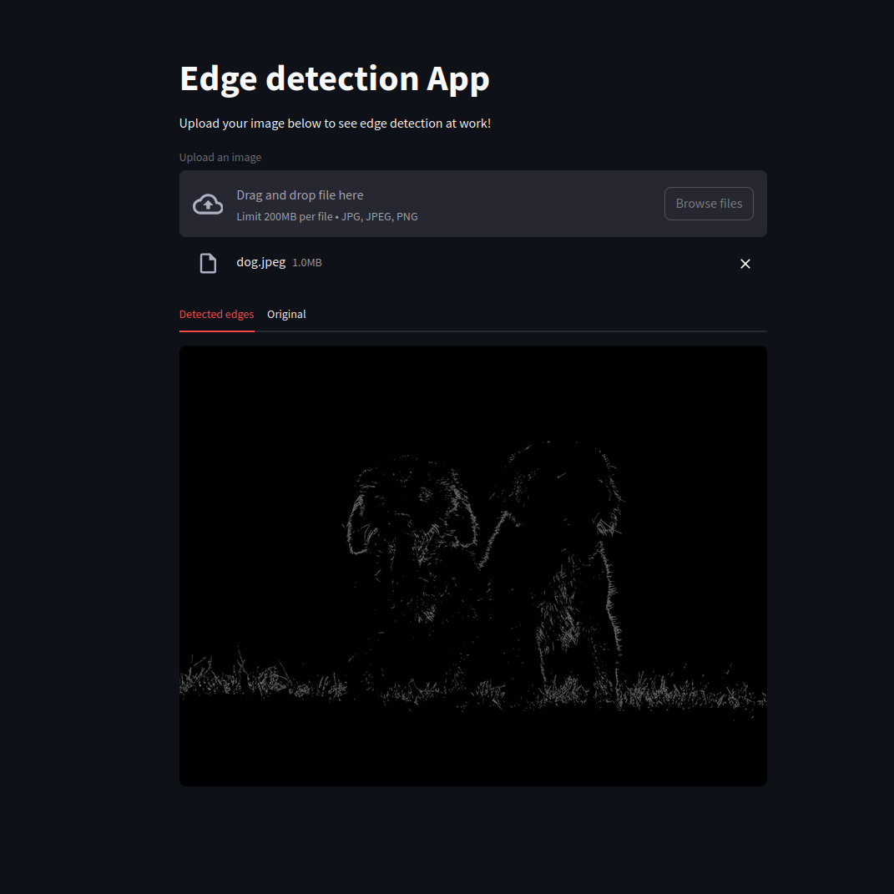

## About
This is a simple proof-of-concept project that utilizes microservice architecture, docker, and kubernetes.
It runs on 3 nodes and enables users to upload a picture and in return get all the edges
that were discovered in the provided image.

## Screenshots



## Technology
- Python 3.12
- Streamlit
- OpenCV
- Requests
- Pillow
- FastAPI
- Numpy
- Uvicorn

## Prerequisites for building & running locally
- Installed minikube
- Installed kubectl
- Installed docker & docker-compose
- Account on DockerHub (change my docker account address for yours in kubernetes-deploy and push_images)

## Power-up the cluster
```
minikube start
```

## Build, push & run:
```
docker-compose build
sh push_images.sh
kubectl apply -f kubernetes-deploy.yaml
minikube service frontend
```

## Cleanup
```
kubectl delete -f kubernetes-deploy.yaml
minikube stop
```
